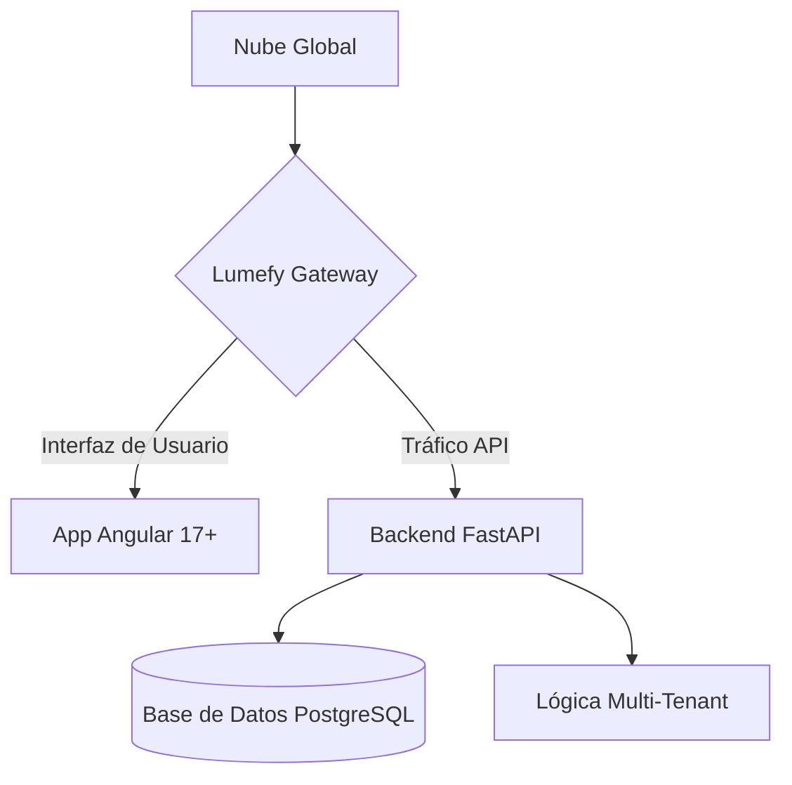

# <p align="center">🚀 Lumefy: Ilumina tu Negocio 💡</p>

<p align="center">
  <b>La plataforma SaaS todo-en-uno para el emprendedor moderno.</b><br>
  <i>Escalable. Modular. Diseñado para Crecer.</i>
</p>

<p align="center">
  
  
  
</p>

---

## 👋 ¿Qué es Lumefy?

Olvídate de los sistemas antiguos y complicados. **Lumefy** es el alma moderna de tu negocio. Ya sea que dirijas una cafetería boutique o un imperio minorista con múltiples sucursales, Lumefy te da las herramientas para gestionar **Inventario, POS (Punto de Venta), CRM y ERP** a través de una interfaz única e impresionante.

### ✨ Por qué te encantará:

*   **🏢 Multi-Todo**: Gestiona múltiples compañías y sucursales desde una sola cuenta. Escala sin límites (Arquitectura SaaS).
*   **⚡ POS Ultra Rápido**: Diseñado para la velocidad. Mantén a tus clientes felices y tus ventas fluyendo.
*   **📦 Magia de Stock**: Seguimiento de inventario en vivo entre sucursales. Nunca te quedes sin tus productos más vendidos.
*   **🛍️ Compras y Ventas**: Ciclo completo de abastecimiento (Proveedores, Órdenes de Compra) y Ventas (Cotizaciones, Pedidos, Facturación).
*   **👥 Poder de Equipo**: Roles y permisos precisos (RBAC). Dale a cada quien las herramientas que necesita, y nada más.
*   **📊 Insights Inteligentes**: Gráficos hermosos que realmente cuentan una historia. Conoce tus números, haz crecer tu negocio.

---

## 🛠️ La Tecnología

No comprometemos la calidad. Lumefy está construido con las tecnologías más amadas del mundo:

-   **Backend**: [FastAPI](https://fastapi.tiangolo.com/) – Para un rendimiento ultrarrápido y código Python limpio.
-   **Frontend**: [Angular](https://angular.io/) – Usando la plantilla premium **Mantis** para una UI/UX de clase mundial.
-   **Base de Datos**: [PostgreSQL](https://www.postgresql.org/) – Confiable, escalable y potente.
-   **Despliegue**: [Docker](https://www.docker.com/) – Porque "funciona en mi máquina" es cosa del pasado.

---

## 🏗️ Arquitectura de un Vistazo



---

## 🏁 Comienza en 5 Minutos

¿Listo para ver la magia? Así es como lo pones en marcha.

### 🐳 La Vía Docker (Recomendado)
```bash
# 1. Clona el código
git clone https://github.com/Alejooc/lumefy.git && cd lumefy

# 2. Enciende los motores
docker-compose up -d --build

# 3. Toque final (Migraciones y Semillas)
docker-compose exec backend alembic upgrade head
# Crea roles y usuario inicial
docker-compose exec backend python seed_roles.py 
```

### 🛠️ Configuración Manual
<details>
<summary><b>Click para ver pasos manuales</b></summary>

#### Backend
```bash
cd backend
python -m venv venv && source venv/bin/activate # o venv\Scripts\activate en Windows
pip install -r requirements.txt
# Configura tu .env basado en .env.example
uvicorn app.main:app --reload
```

#### Frontend
```bash
cd frontend_mantis
npm install
npm start
```
</details>

---

## 🤝 Únete al Viaje

Lumefy está construido por soñadores, para hacedores. Si quieres contribuir, encontrar un bug, o solo decir hola, ¡siéntete libre de abrir un issue o pull request!

---

<p align="center">
  <b>Construido con ✨ por Alejooc</b><br>
  <i>"Empoderando negocios, una línea de código a la vez."</i>
</p>
