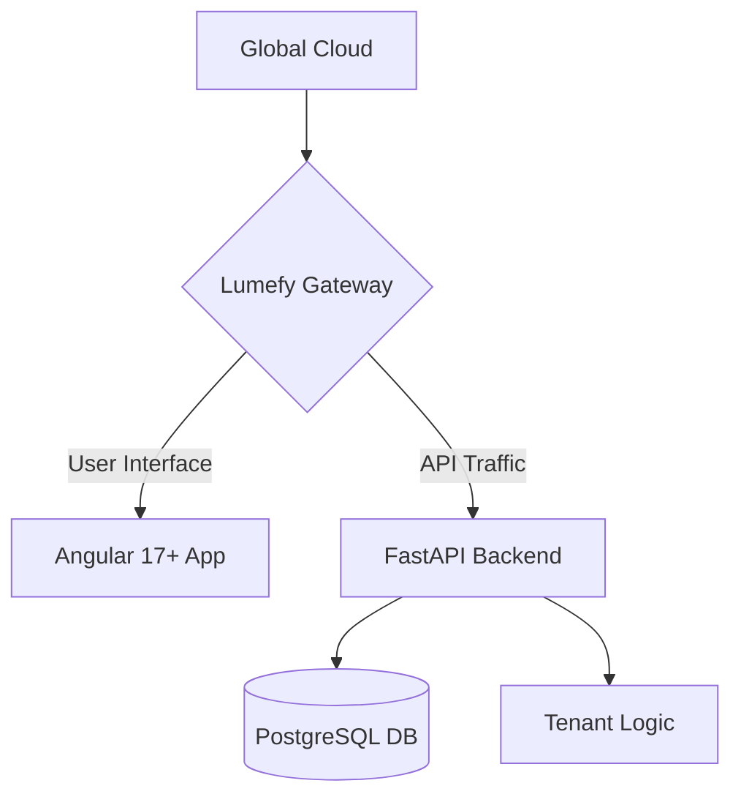

# <p align="center">🚀 Lumefy: Light up your Business 💡</p>

<p align="center">
  <b>The all-in-one SaaS powerhouse for the modern entrepreneur.</b><br>
  <i>Scalable. Modular. Built for Growth.</i>
</p>

<p align="center">
  
  
  
</p>

---

## 👋 What is Lumefy?

Forget clunky legacy systems. **Lumefy** is the modern soul of your business. Whether you're running a boutique coffee shop or a multi-branch retail empire, Lumefy gives you the tools to manage **Inventory, POS, CRM, and ERP** through a single, stunning interface.

### ✨ Why you'll love it:

*   **🏢 Multi-Everything**: Manage multiple companies and branches from one account. Scale without limits.
*   **⚡ Blazing Fast POS**: Designed for speed. Keep your customers happy and your sales flowing.
*   **📦 Stock Magic**: Live inventory tracking. Never run out of your bestsellers again.
*   **👥 Team Power**: Precision roles and permissions. Give everyone the tools they need, and nothing more.
*   **📊 Smart Insights**: Beautiful charts that actually tell a story. Know your numbers, grow your business.

---

## 🛠️ The Tech Sauce

We didn't compromise on quality. Lumefy is built with the world's most loved technologies:

-   **Backend**: [FastAPI](https://fastapi.tiangolo.com/) – For lightning-fast performance and clean Python code.
-   **Frontend**: [Angular](https://angular.io/) – Using the premium **Mantis** template for a world-class UI/UX.
-   **Database**: [PostgreSQL](https://www.postgresql.org/) – Reliable, scalable, and powerful.
-   **Deployment**: [Docker](https://www.docker.com/) – Because "it works on my machine" is a thing of the past.

---

## 🏗️ Architecture at a Glance



---

## 🏁 Get Started in 5 Minutes

Ready to see the magic? Here's how to get running.

### 🐳 The Docker Way (Recommended)
```bash
# 1. Grab the code
git clone https://github.com/Alejooc/lumefy.git && cd lumefy

# 2. Fire it up
docker-compose up -d --build

# 3. Final touch (Migrations)
docker-compose exec backend alembic upgrade head
docker-compose exec backend python seed_roles.py
```

### 🛠️ Manual setup
<details>
<summary><b>Click to show manual steps</b></summary>

#### Backend
```bash
cd backend
python -m venv venv && source venv/bin/activate
pip install -r requirements.txt
uvicorn app.main:app --reload
```

#### Frontend
```bash
cd frontend_mantis
npm install
npm start
```
</details>

---

## 🤝 Join the Journey

Lumefy is built by dreamers, for doers. If you want to contribute, find a bug, or just say hi, feel free to open an issue or pull request!

---

<p align="center">
  <b>Built with ✨ by Alejooc</b><br>
  <i>"Empowering businesses, one line of code at a time."</i>
</p>
