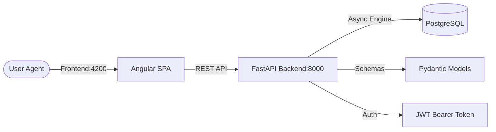

# <p align="center">  </p>

<p align="center">
  <b>The Unified SaaS Solution for Modern Business Management</b><br>
  <i>Inventory • POS • CRM • ERP • Multi-Tenant Architecture</i>
</p>

<p align="center">
  
  
  
  
  
</p>

---

## ⚡ Quick Start (Docker)

The fastest way to deploy the entire stack is using **Docker Compose**.

1. **Clone & Configure**
   ```bash
   git clone https://github.com/Alejooc/lumefy.git
   cd lumefy
   cp backend/.env.example backend/.env
   ```

2. **Launch Services**
   ```bash
   docker-compose up --build -d
   ```

3. **Initialize Database**
   ```bash
   docker-compose exec backend alembic upgrade head
   docker-compose exec backend python seed_roles.py
   ```

---

## 🏗️ Architecture

Lumefy is built on a modern, decoupled architecture designed for high availability and scalability.



---

## 🛠️ Detailed Installation

### Backend (FastAPI)
The backend requires Python 3.11+.

1. **Virtual Environment**
   ```bash
   cd backend
   python -m venv venv
   .\venv\Scripts\activate # Windows
   pip install -r requirements.txt
   ```
2. **Environment Variables**
   Create a `.env` file with the following:
   ```env
   POSTGRES_USER=postgres
   POSTGRES_PASSWORD=postgres
   POSTGRES_SERVER=localhost
   POSTGRES_PORT=5432
   POSTGRES_DB=lumefy
   SECRET_KEY=super-secret-key-change-me
   ```
3. **Run Dev Server**
   ```bash
   uvicorn app.main:app --reload --port 8000
   ```

### Frontend (Angular)
The frontend uses the premium **Mantis Template**.

1. **Install Deps**
   ```bash
   cd frontend_mantis
   npm install
   ```
2. **Launch**
   ```bash
   npm start # Runs on http://localhost:4200
   ```

---

## 🛡️ Role-Based Access Control (RBAC)
Lumefy uses a structured permission system stored as `JSONB` for flexibility.

| Role | Permissions | Description |
| :--- | :--- | :--- |
| **ADMIN** | `{"all": true}` | Full system access |
| **MANAGER** | `{"manage_users": true, ...}` | Store-level operations |
| **CASHIER** | `{"pos_access": true, ...}` | Selling and inventory view |

---

## 🧩 Modularity
Each module is designed to be isolated yet integrated:
- **`app/api/v1/`**: Versioned API endpoints.
- **`app/models/`**: Domain models with SQLAlchemy.
- **`src/app/modules/`**: Feature-based Angular modules.

---

## 🔧 Troubleshooting

- **CORS Errors**: Ensure `BACKEND_CORS_ORIGINS` in your `.env` includes your development URL.
- **Migration Issues**: If `alembic upgrade head` fails, verify your PostgreSQL connection string in `.env`.
- **Node Modules**: If the frontend fails to build, try `npm cache clean --force` followed by a fresh `npm install`.

---

<p align="center">
  <b>Developed by the Lumefy Engineering Team</b>
</p>
