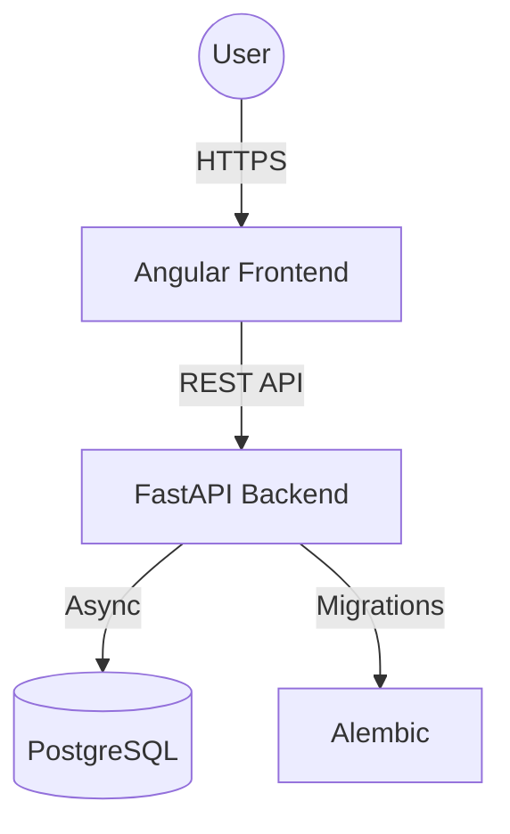

# <p align="center">✨ Lumefy SaaS Platform ✨</p>

<p align="center">
  
  
  
  
  
</p>

---

## 🚀 Overview

**Lumefy** is a high-performance, multi-tenant SaaS platform designed to revolutionize business management. From core ERP functionalities to a seamless Point of Sale (POS) experience, Lumefy provides a unified solution for modern enterprises.

### 💎 Key Features

- **🏢 Multi-Tenant & Multi-Branch**: Built to scale. Manage multiple companies and their branches from a single dashboard.
- **⚡ Real-time POS**: Fast, reliable, and intuitive point-of-sale interface.
- **📦 Intelligent Inventory**: Track stock levels, history, and low-stock alerts with precision.
- **👥 Advanced User Control**: Granular Role-Based Access Control (RBAC) to keep your data secure.
- **📊 Rich Analytics**: Dynamic charts and reports powered by structured data insights.
- **🔒 Secure Authentication**: JWT-based stateless authentication with secure password hashing.

---

## 🛠️ Tech Stack

### Backend (The Brain)
- **FastAPI**: Modern, high-performance Python web framework.
- **SQLAlchemy 2.0**: Next-gen async ORM for robust data management.
- **Alembic**: Reliable database migration tool.
- **PostgreSQL**: Industry-standard relational database.

### Frontend (The Face)
- **Angular 17+**: Enterprise-grade frontend framework.
- **Mantis Template**: Premium UI/UX design foundation.
- **RxJS & Signals**: Advanced state and event management.
- **SweetAlert2**: Beautiful and responsive notifications.

---

## 🏗️ Architecture



---

## 🚦 Getting Started

### 🐳 Quick Start with Docker
The fastest way to get Lumefy up and running:

```bash
# Clone the repository
git clone https://github.com/Alejooc/lumefy.git
cd lumefy

# Start the engine
docker-compose up --build -d

# Initialize Database
docker-compose exec backend alembic upgrade head
```

### 💻 Local Development

#### Backend Setup
```bash
cd backend
python -m venv venv
source venv/bin/activate # Windows: .\venv\Scripts\activate
pip install -r requirements.txt
uvicorn app.main:app --reload
```

#### Frontend Setup
```bash
cd frontend_mantis
npm install
npm start
```

---

## 📁 Project Structure

```text
lumefy/
├── backend/            # FastAPI Microservice
│   ├── app/            # Core logic & Endpoints
│   └── alembic/        # DB Migrations
├── frontend_mantis/    # Angular Application
│   └── src/app/        # Feature Modules & UI
└── docker-compose.yml  # System Orchestration
```

---

## 📄 License
This project is licensed under the MIT License - see the [LICENSE](LICENSE) file for details.

---
<p align="center">Created with ❤️ by the Lumefy Team</p>
