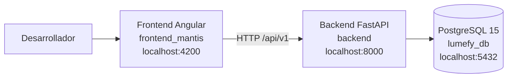
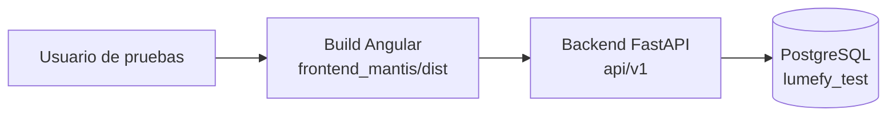

# Documentacion de Ambientes de Desarrollo y Pruebas

## 1. Objetivo

Este documento describe los ambientes usados para el desarrollo y las pruebas del proyecto Lumefy, limitados a los componentes:

- `frontend_mantis`: cliente web en Angular
- `backend`: API REST en FastAPI

No se incluye `storefront_nextmerce` porque no hace parte del alcance actual de la entrega.

## 2. Alcance tecnico

La solucion esta compuesta por:

- Frontend: Angular 21
- Backend: FastAPI
- Persistencia: PostgreSQL 15
- Contenedorizacion base: Docker Compose

## 3. Ambiente de desarrollo

### 3.1 Proposito

Permite a los desarrolladores ejecutar, depurar y validar cambios funcionales sobre frontend y backend en una instalacion local.

### 3.2 Componentes del ambiente

- Aplicacion Angular ejecutada con `ng serve`
- API FastAPI ejecutada con `uvicorn`
- Base de datos PostgreSQL
- Docker Compose para levantar base de datos y backend cuando se trabaja con contenedores

### 3.3 Tecnologias identificadas en el proyecto

#### Frontend

- Framework: Angular `21.0.3`
- Gestor de paquetes: `npm`
- Comando principal de desarrollo: `npm start`
- Puerto de desarrollo: `4200`
- URL de API configurada: `http://localhost:8000/api/v1`

#### Backend

- Framework: FastAPI
- Servidor ASGI: `uvicorn`
- ORM: SQLAlchemy
- Migraciones: Alembic
- Puerto de API: `8000`
- Documentacion interactiva: `http://localhost:8000/docs`

#### Base de datos

- Motor: PostgreSQL 15
- Puerto: `5432`
- Base de datos por defecto: `lumefy_db`

### 3.4 Variables de entorno relevantes del backend

Las variables base identificadas en `backend/.env.example` son:

- `POSTGRES_SERVER`
- `POSTGRES_USER`
- `POSTGRES_PASSWORD`
- `POSTGRES_DB`
- `POSTGRES_PORT`
- `DATABASE_URL`
- `SECRET_KEY`
- `ALGORITHM`
- `ACCESS_TOKEN_EXPIRE_MINUTES`
- `FIRST_SUPERUSER`
- `FIRST_SUPERUSER_PASSWORD`
- `PROJECT_NAME`
- `API_V1_STR`

### 3.5 Puesta en marcha del ambiente de desarrollo

#### Opcion A. Desarrollo con Docker Compose

1. Clonar el repositorio.
2. Crear el archivo `backend/.env` a partir de `backend/.env.example`.
3. Levantar servicios:

```powershell
docker compose up -d --build
```

4. Ejecutar migraciones:

```powershell
docker compose exec backend python -m alembic upgrade head
```

5. Cargar datos iniciales:

```powershell
docker compose exec backend python seed_roles.py
docker compose exec backend python seed_saas.py
docker compose exec backend python ensure_admin_role.py
```

#### Opcion B. Desarrollo mixto

Esta opcion es util cuando se desea depurar Angular en caliente:

1. Levantar PostgreSQL y backend.
2. Ejecutar el frontend por separado:

```powershell
cd frontend_mantis
npm install
npm start
```

### 3.6 URLs del ambiente de desarrollo

- Frontend: `http://localhost:4200`
- Backend API: `http://localhost:8000`
- Swagger/OpenAPI: `http://localhost:8000/docs`

### 3.7 Diagrama del ambiente de desarrollo



## 4. Ambiente de pruebas

### 4.1 Proposito

Permite validar que los desarrollos funcionen de forma controlada antes de una demostracion o entrega.

### 4.2 Criterio de documentacion

En el repositorio no se identifica un ambiente QA separado ya preconfigurado. Por tanto, para la evidencia se documenta un ambiente de pruebas funcionales derivado del proyecto actual, usando aislamiento de base de datos y compilacion estable del frontend.

### 4.3 Caracteristicas del ambiente de pruebas

- Misma base tecnologica del ambiente de desarrollo
- Base de datos separada de desarrollo
- Ejecucion del frontend compilado desde `frontend_mantis/dist`
- Validacion de rutas, autenticacion y consumo de API
- Pruebas manuales y tecnicas de humo sobre modulos criticos

### 4.4 Configuracion recomendada

#### Backend de pruebas

- Variable `POSTGRES_DB`: una base distinta, por ejemplo `lumefy_test`
- Usuario y credenciales controladas para pruebas
- Migraciones aplicadas con Alembic
- Datos semilla minimos para autenticacion, roles y empresa

#### Frontend de pruebas

- Compilacion de produccion:

```powershell
cd frontend_mantis
npm run build
```

- Resultado esperado en:

`frontend_mantis/dist`

### 4.5 Flujo de pruebas funcionales

1. Autenticacion de usuario administrador.
2. Consulta de dashboard.
3. Gestion de catalogo:
   - categorias
   - marcas
   - productos
4. Operacion:
   - inventario
   - compras
   - ventas
   - devoluciones
5. Administracion:
   - usuarios
   - roles
   - auditoria
6. Verificacion de reportes y exportaciones.

### 4.6 Diagrama del ambiente de pruebas



### 4.7 Casos minimos de validacion

- Inicio de sesion exitoso
- Acceso controlado por roles
- Consulta y registro de productos
- Consulta y movimiento de inventario
- Registro de compras y ventas
- Consulta de reportes
- Acceso a auditoria
- Respuesta del backend en `/docs`

## 5. Diferencias entre ambientes

| Aspecto | Desarrollo | Pruebas |
|---|---|---|
| Objetivo | Construccion y depuracion | Validacion previa a entrega |
| Frontend | `ng serve` | build compilado |
| Backend | modo recarga | ejecucion controlada |
| Base de datos | `lumefy_db` | base aislada, por ejemplo `lumefy_test` |
| Datos | flexibles para desarrollo | datos controlados |
| Enfoque | cambio rapido | estabilidad funcional |

