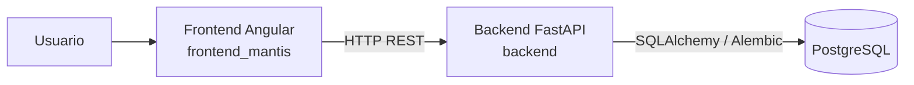
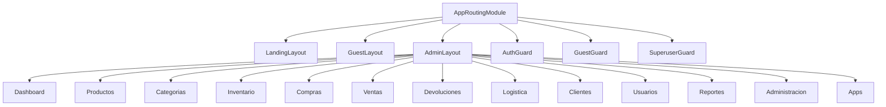
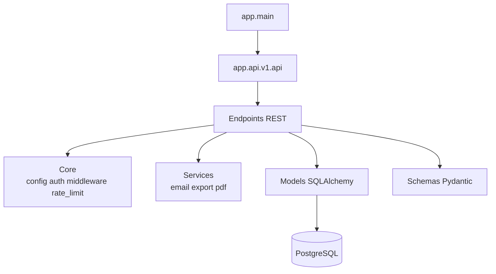
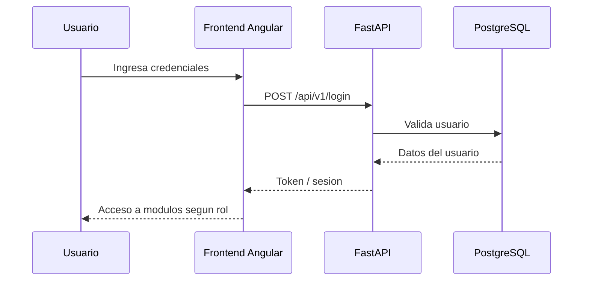
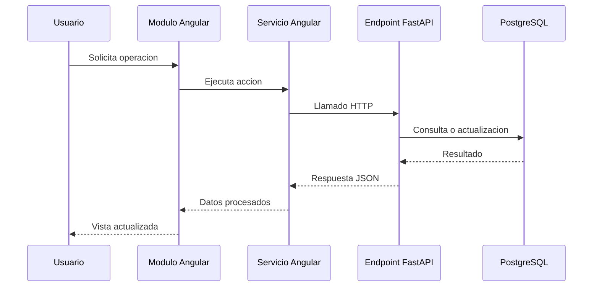

# Diagramas de Arquitectura de Lumefy

## 1. Alcance

Los diagramas incluidos en este documento corresponden exclusivamente a:

- `frontend_mantis`
- `backend`
- PostgreSQL

## 2. Arquitectura general

## 3. Arquitectura logica del frontend

## 4. Arquitectura logica del backend

## 5. Flujo de autenticacion

## 6. Flujo de consumo de modulos

## 7. Modulos funcionales identificados

### Frontend

- autenticacion
- dashboard
- productos
- categorias
- inventario
- compras
- ventas
- devoluciones
- logistica
- clientes
- usuarios
- auditoria
- reportes
- administracion
- apps

### Backend API

- `login`
- `products`
- `categories`
- `inventory`
- `pos`
- `companies`
- `reports`
- `clients`
- `users`
- `roles`
- `audit`
- `suppliers`
- `purchases`
- `pricelists`
- `sales`
- `admin`
- `plans`
- `branches`
- `logistics`
- `brands`
- `units-of-measure`
- `upload`
- `dashboard`
- `system`
- `search`
- `notifications`
- `apps`
- `storefront`
- `stock-take`
- `returns`

