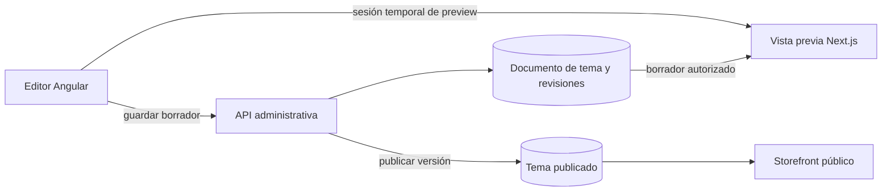

# Plan de ejecución: editor visual del storefront

## Estado

- **Fecha de creación:** 2026-08-26.
- **Estado:** en implementación; primera entrega del MVP del inicio completada en código y preview seguro conectado.
- **Objetivo:** reemplazar el formulario actual de configuración del inicio por un editor visual en vivo, extensible al resto del storefront.
- **Modelo elegido:** editor estructurado de secciones y bloques, similar al editor de temas de Shopify.
- **Decisión técnica:** construirlo sobre la arquitectura actual de Lumefy, sin almacenar HTML o JavaScript arbitrario y sin depender de un CMS externo.

## Estado de la primera entrega

Esta entrega implementa el primer vertical funcional del editor del inicio:

- documento de tema separado por `company_id`, `storefront_id` y plantilla;
- migración compatible desde `theme_settings.home`;
- API administrativa para componentes, borrador, publicación, historial y restauración;
- control de concurrencia por `draft_version` con bloqueo de fila en operaciones de escritura;
- auditoría de guardado, publicación y restauración;
- validación de payloads para rechazar scripts, handlers, HTML ejecutable, protocolos peligrosos y documentos sobredimensionados;
- renderizador Next basado en secciones publicadas, con fallback legacy;
- editor Angular de tres paneles con drag and drop, propiedades contextuales, preview real, responsive, borrador y publicación;
- selectores tenant-scoped de productos y colecciones para los bloques de catálogo;
- sugerencias de enlaces internos del storefront y soporte para URLs externas;
- biblioteca de imágenes aislada por storefront, con carga validada y selección visual;
- deshacer y rehacer local con hasta 50 estados;
- sesión de preview firmada, temporal y limitada a `storefront_id`, `company_id` y plantilla, sin enviar el JWT administrativo al iframe.

Queda para las siguientes entregas: edición completa de bloques, header/footer y plantillas de producto, colección y páginas informativas. La migración nueva todavía no se ha ejecutado en producción.

## Resultado esperado

Cada empresa podrá personalizar su storefront desde el panel mediante una interfaz visual con:

- vista previa real en escritorio, tablet y móvil;
- secciones y bloques que se puedan agregar, ordenar, duplicar, ocultar y eliminar;
- edición de textos, imágenes, colores, enlaces, productos y colecciones;
- borradores separados de la versión pública;
- publicación explícita, historial y restauración de versiones;
- plantillas para inicio, producto, colección y páginas informativas;
- aislamiento estricto por `company_id` y `storefront_id`.

La lógica sensible de precios, inventario, autenticación, pedidos, pagos y checkout seguirá controlada por el backend. El editor solo podrá configurar las opciones visuales y de contenido autorizadas por cada componente.

## Alcance funcional

### Editable por el comerciante

- Página de inicio.
- Encabezado, logo, barra de anuncios y navegación.
- Pie de página, información de contacto y redes sociales.
- Colores, tipografías, radios, espaciados y estilo global.
- Secciones de productos, colecciones, promociones y contenido.
- Página de producto y página de colección.
- Páginas informativas como contacto, nosotros y políticas.
- Apariencia permitida del carrito y checkout.
- Plantillas alternativas y asignación por recurso.

### Protegido por la plataforma

- Cálculo de precios, descuentos, impuestos y envío.
- Validación y reserva de inventario.
- Creación y estado de pedidos.
- Credenciales y procesamiento de pagos.
- Autenticación y sesiones.
- Reglas de aislamiento entre empresas y storefronts.
- Código ejecutable, scripts y HTML sin sanitizar.

## Arquitectura actual que se reutiliza

- El panel administrativo está construido en Angular y ya cuenta con Angular CDK.
- El storefront está construido en Next.js/React y ya contiene componentes visuales reutilizables.
- FastAPI expone la administración y el contenido público del storefront.
- PostgreSQL almacena actualmente la personalización en `theme_settings`.
- El editor actual ya define hero, promociones, categorías, productos destacados, beneficios, testimonios, newsletter y otros contenidos.

No se reemplazarán estas piezas. Se añadirá una capa visual y un formato de documento ordenado para coordinarlas.

## Arquitectura objetivo



La pantalla principal tendrá tres áreas:

1. **Estructura:** árbol de secciones y bloques con drag and drop.
2. **Vista previa:** storefront real dentro de un iframe controlado.
3. **Propiedades:** formulario contextual del elemento seleccionado.

## Modelo de documento propuesto

El contrato objetivo conserva la idea de secciones y bloques estables. Para el primer vertical se usa una representación de listas (`sections` y `blocks`) porque permite migrar y renderizar el home actual sin cambiar todavía todos los componentes. La evolución a mapas con `order` queda reservada para cuando se incorporen plantillas alternativas y bloques anidados.

```json
{
  "schema_version": 1,
  "template": "home",
  "settings": {
    "content_width": "wide",
    "section_spacing": "comfortable"
  },
  "sections": [
    {
      "id": "hero-1",
      "type": "hero",
      "enabled": true,
      "settings": {
        "layout": "editorial",
        "overlay_opacity": 0.25
      },
      "blocks": [
        {
          "id": "slide-1",
          "type": "slide",
          "settings": {
            "title": "Nueva colección",
            "button_label": "Ver productos"
          }
        }
      ]
    }
  ]
}
```

Reglas del documento:

- cada sección y bloque tendrá un ID estable;
- el tipo deberá existir en el registro de componentes permitido;
- las propiedades se validarán en backend según su esquema;
- los arrays de orden no podrán contener duplicados ni IDs inexistentes;
- habrá límites de cantidad y tamaño por tipo de bloque;
- no se aceptará código ejecutable enviado por el usuario.

## Persistencia propuesta

Crear entidades separadas para evitar que una edición cambie inmediatamente la tienda pública:

### `storefront_theme_documents`

- `id`
- `company_id`
- `storefront_id`
- `template_key`
- `draft_document`
- `published_document`
- `draft_version`
- `published_version`
- `created_at`
- `updated_at`
- `published_at`
- `published_by`

### `storefront_theme_revisions`

- `id`
- `company_id`
- `storefront_id`
- `theme_document_id`
- `version`
- `document`
- `operation`
- `created_by`
- `created_at`

Agregar constraints compuestas para impedir que un documento, revisión o plantilla relacione empresas diferentes.

## API necesaria

La primera entrega expone el siguiente contrato equivalente, con rutas compactas para mantener compatibilidad con el router actual:

- `GET /storefront/{id}/theme/components`;
- `GET /storefront/{id}/theme/{template}`;
- `PUT /storefront/{id}/theme/{template}/draft`;
- `POST /storefront/{id}/theme/{template}/publish`;
- `GET /storefront/{id}/theme/{template}/revisions`;
- `POST /storefront/{id}/theme/{template}/restore/{revision_id}`.

- `POST /storefront/{id}/theme/{template}/preview-session`: crear una sesión firmada de 15 minutos y devolver la URL de preview.

- `GET /storefront/{id}/theme/templates/{template}`: cargar borrador y metadatos.
- `PUT /storefront/{id}/theme/templates/{template}/draft`: guardar borrador con control de versión.
- `POST /storefront/{id}/theme/templates/{template}/publish`: publicar el borrador actual.
- `GET /storefront/{id}/theme/templates/{template}/revisions`: consultar historial.
- `POST /storefront/{id}/theme/templates/{template}/restore/{revision_id}`: restaurar como nuevo borrador.
- `GET /storefront/{id}/theme/component-registry`: obtener bloques disponibles y sus campos.

Todas las rutas deben validar usuario, permiso, `company_id`, `storefront_id` y versión esperada. La API pública solo debe entregar el documento publicado.

## Fase 0 — Contrato y compatibilidad

**Estimación:** 1 día.

- [x] Inventariar los campos actuales de `theme_settings` usados por el inicio.
- [x] Definir el registro inicial de secciones y bloques.
- [x] Definir schemas backend y tipos compartidos del documento.
- [x] Crear estrategia de migración compatible desde `theme_settings.home`.
- [x] Definir límites de contenido, documentos, secciones y bloques.
- [x] Documentar qué configuraciones seguirán en módulos separados.

**Salida:** contrato JSON versionado y fixtures de compatibilidad aprobados.

## Fase 1 — Backend de borradores y publicación

**Estimación:** 1–2 días.

- [x] Crear modelos y migración de base de datos.
- [x] Agregar constraints tenant-scoped.
- [x] Implementar lectura y guardado de borrador.
- [x] Implementar publicación atómica.
- [x] Implementar historial y restauración.
- [x] Agregar control de concurrencia con `draft_version`.
- [x] Crear sesiones de preview firmadas, temporales y limitadas al storefront.
- [x] Añadir auditoría de guardado, publicación y restauración.

**Salida:** el borrador nunca afecta la versión pública hasta publicar.

## Fase 2 — Renderizador dinámico del storefront

**Estimación:** 2–3 días.

- [x] Crear registro inicial React de tipos de sección y sus componentes.
- [x] Renderizar las secciones según el orden del documento.
- [x] Respetar `enabled` y orden de secciones; los bloques se incorporan en la siguiente iteración.
- [x] Reutilizar los componentes existentes de Home.
- [x] Mantener fallback para la configuración legacy.
- [x] Implementar modo preview autenticado sin cache público.
- [x] Mantener el storefront publicado con cache seguro por tenant.
- [ ] Mostrar un fallback controlado si una sección desconocida no puede renderizarse.

**Salida:** el storefront puede renderizar documentos nuevos y configuraciones anteriores.

## Fase 3 — Editor visual del inicio

**Estimación:** 3–5 días.

- [x] Construir layout de tres paneles.
- [x] Implementar árbol de secciones con Angular CDK Drag and Drop.
- [x] Agregar, ordenar, duplicar, ocultar y eliminar secciones.
- [x] Seleccionar secciones haciendo clic en el árbol o en la vista previa; la selección de bloques queda para la siguiente iteración.
- [ ] Generar formularios desde el registro de propiedades.
- [x] Sincronizar cambios no guardados con el iframe mediante `postMessage` de configuración.
- [x] Agregar vistas de escritorio, tablet y móvil.
- [x] Implementar deshacer y rehacer local.
- [x] Mostrar estado: sin cambios, cambios pendientes, guardando y publicado.
- [x] Advertir antes de cerrar si existen cambios no guardados.

**Salida:** edición visual completa del inicio con borrador y publicación.

## Fase 4 — Biblioteca inicial de componentes

**Estimación:** 3–5 días.

- [ ] Hero y carrusel.
- [ ] Tarjetas promocionales.
- [ ] Categorías y colecciones.
- [ ] Grilla y carrusel de productos.
- [ ] Productos nuevos y destacados.
- [ ] Banners editoriales.
- [ ] Cuenta regresiva.
- [ ] Beneficios y características.
- [ ] Testimonios.
- [ ] Newsletter.
- [ ] Texto enriquecido sanitizado.
- [ ] Imagen, video permitido, separador y espacio.
- [ ] CTA final.

Cada componente debe incluir defaults, validación, límites, responsive y estado vacío.

## Fase 5 — Selectores de contenido y medios

**Estimación:** 2–3 días.

- [x] Selector tenant-scoped de productos publicados.
- [x] Selector tenant-scoped de colecciones.
- [x] Biblioteca de imágenes autorizadas del storefront.
- [x] Carga de imágenes con progreso y validación.
- [x] Selector de enlaces internos para evitar escribir rutas manualmente.
- [x] Controles visuales de color, opacidad, alineación y posición para el hero y sus campañas.
- [x] Validar que un storefront no pueda seleccionar productos o colecciones de otro.

**Salida:** la mayoría de campos técnicos de URL desaparece de la experiencia del usuario.

## Fase 6 — Elementos globales

**Estimación:** 2–3 días.

- [ ] Barra de anuncios.
- [ ] Header y variantes de navegación.
- [ ] Logo, favicon y logos alternativos.
- [ ] Paleta y tipografías.
- [ ] Ancho de contenido, radios y espaciados.
- [ ] Footer, contacto, legales y redes sociales.
- [ ] Vista previa global en todas las plantillas.

**Salida:** branding y navegación dejan de depender de formularios separados.

## Fase 7 — Plantillas completas

**Estimación:** 4–7 días.

- [ ] Plantilla de producto.
- [ ] Plantilla de colección.
- [ ] Resultados de búsqueda.
- [ ] Carrito.
- [ ] Páginas informativas.
- [ ] Apariencia permitida del checkout.
- [ ] Duplicar plantillas.
- [ ] Crear plantillas alternativas.
- [ ] Asignar plantillas a productos, colecciones o páginas.

**Salida:** CMS visual completo comparable al editor de temas de Shopify.

## Fase 8 — Calidad, seguridad y operación

**Estimación:** 2–3 días.

- [x] Pruebas unitarias del contrato, límites y sanitización del documento.
- [ ] Pruebas de autorización Empresa A/B.
- [ ] Pruebas de borrador vs. publicado.
- [x] Pruebas unitarias de token de preview expirado, scope incorrecto y claims tenant-scoped.
- [ ] Pruebas de publicación concurrente.
- [ ] Pruebas de historial y restauración.
- [ ] Pruebas responsive y accesibilidad.
- [ ] Presupuesto de rendimiento por sección.
- [x] Auditoría de sanitización y URLs del documento y preview.
- [x] Validar lint y build de admin y storefront; la migración y smoke de producción quedan pendientes de ejecutarse en el servidor.

## Migración de tiendas existentes

1. Leer `theme_settings.home` actual.
2. Convertir cada bloque existente a una sección del documento nuevo.
3. Conservar IDs, textos, imágenes, colores y enlaces cuando existan.
4. Crear borrador y publicación inicial con el mismo contenido.
5. Mantener el renderizador legacy durante el periodo de transición.
6. Comparar visualmente la versión anterior y la migrada.
7. Retirar el fallback únicamente después de migrar y verificar todas las tiendas.

La migración debe ser idempotente y no debe eliminar `theme_settings` durante el primer rollout.

## Seguridad y aislamiento

- Resolver siempre la empresa desde el usuario autenticado; no confiar en IDs enviados por el navegador.
- Validar que documento, revisión, producto, colección y asset pertenezcan al mismo storefront y empresa.
- No enviar el JWT administrativo al iframe mediante query string.
- Usar una sesión de preview firmada, de corta duración y limitada a un storefront; no reutilizar el JWT administrativo.
- Validar `origin`, tipo y esquema de todos los mensajes `postMessage`.
- Prohibir scripts, handlers HTML, iframes arbitrarios y CSS sin límites.
- Sanitizar contenido enriquecido en backend y frontend.
- No incluir credenciales de pago, integraciones o datos privados dentro del documento del tema.
- Mantener el preview fuera del cache público y el contenido publicado cacheado por storefront.
- Registrar publicaciones, restauraciones y cambios sensibles en auditoría.

## Rollout

1. Desplegar modelos y API sin cambiar el editor actual.
2. Activar el renderizador nuevo detrás de un feature flag.
3. Habilitar el editor para una tienda interna.
4. Comparar preview y storefront publicado en escritorio y móvil.
5. Habilitar una empresa piloto.
6. Observar errores, rendimiento y publicaciones durante un periodo controlado.
7. Habilitar progresivamente el resto de empresas.
8. Retirar el editor anterior cuando ya no existan tiendas legacy.

## Rollback

- Desactivar el feature flag del editor nuevo.
- Volver a renderizar desde `theme_settings` legacy.
- No ejecutar downgrade destructivo de documentos o revisiones.
- Mantener todas las publicaciones como revisiones recuperables.
- Si una publicación produce errores, restaurar la última revisión conocida como nueva versión publicada.
- Restaurar la base completa únicamente ante corrupción no reparable y usando el respaldo previo al despliegue.

## Criterios de aceptación del MVP

- [x] Un usuario puede agregar, ordenar, ocultar, duplicar y eliminar secciones del inicio.
- [x] La vista previa refleja cambios sin modificar la tienda pública.
- [x] Escritorio, tablet y móvil se pueden revisar desde el editor.
- [x] Los productos, colecciones, imágenes editables del inicio y enlaces se seleccionan visualmente.
- [x] Guardar crea un borrador y publicar actualiza la tienda de forma atómica.
- [x] Se puede restaurar una versión anterior.
- [x] Dos usuarios concurrentes no sobrescriben cambios silenciosamente.
- [x] Empresa A no puede leer, previsualizar ni publicar el tema de Empresa B.
- [x] Una sesión de preview expirada o de otro storefront es rechazada.
- [x] Las tiendas existentes conservan su apariencia durante la migración.
- [x] Backend, admin y storefront pasan pruebas, lint y build; el smoke de producción y la migración final se ejecutan en el servidor.

## Criterios de finalización del CMS completo

- [ ] Inicio, header, footer, producto, colección y páginas informativas usan el sistema de plantillas.
- [ ] Los componentes principales tienen configuración responsive.
- [ ] Existen borradores, publicación, historial y restauración.
- [ ] Se pueden crear y asignar plantillas alternativas.
- [ ] La biblioteca de componentes está documentada y es extensible por desarrolladores.
- [ ] El editor anterior y el fallback legacy pueden retirarse sin pérdida de datos.
- [ ] El aislamiento A/B y la seguridad de preview pasan en CI.
- [ ] Una empresa piloto publica cambios sin asistencia técnica.

## Estimación general

- **MVP del inicio:** aproximadamente 7–11 días de implementación y validación acumulada.
- **CMS completo:** aproximadamente 2–4 semanas, dependiendo del número de plantillas y componentes incluidos en la primera versión.

Las estimaciones corresponden al alcance completo descrito. El trabajo puede entregarse incrementalmente sin esperar a que todas las fases estén terminadas.

## Primer paquete recomendado

Cuando se autorice la ejecución, comenzar únicamente con:

1. contrato JSON y migración compatible;
2. borrador, publicación y revisión;
3. renderizador dinámico del inicio;
4. editor visual de tres paneles;
5. componentes actuales del Home;
6. selector de productos, colecciones e imágenes;
7. pruebas tenant A/B y despliegue piloto.

Este paquete entrega valor inmediato y establece la arquitectura sobre la que se añadirán las demás páginas sin rehacer el editor.
