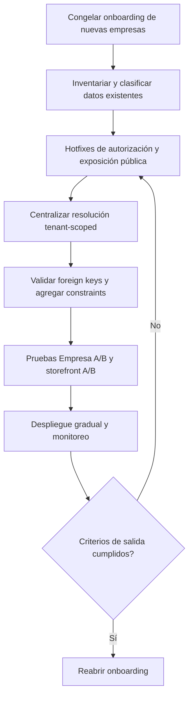

# Flujo de trabajo: aislamiento multiempresa y ecommerce

## Decisión actual

No debemos habilitar nuevas empresas con una garantía fuerte de aislamiento todavía. El sistema tiene una base correcta —`company_id`, permisos por usuario y resolución de storefront por `storefront_id`—, pero la revisión estática encontró rutas donde esa regla no se aplica de forma consistente.

Este documento define el orden de trabajo para cerrar los hallazgos, comprobar datos históricos y habilitar nuevamente el onboarding con evidencia reproducible.

## Estado de implementación

- [x] Hotfixes tenant-scoped para CRM, productos/variantes, listas de precios, compras, POS y relaciones de catálogo.
- [x] Contención del proxy de integraciones autenticadas y allowlist de la ruta pública de media.
- [x] Pruebas de regresión nuevas y suite backend ejecutada.
- [x] Migración fail-closed creada en [`fl1a2b3c4d5e_harden_tenant_boundaries.py`](../backend/alembic/versions/fl1a2b3c4d5e_harden_tenant_boundaries.py): hace backfill de variantes, storefronts e integraciones y se detiene ante inconsistencias.
- [x] Auditor de solo lectura creado en [`audit_tenant_boundaries.py`](../backend/scripts/audit_tenant_boundaries.py) para generar el reporte JSON previo al backfill.
- [x] Auditor local ejecutado dentro de Docker: cero inconsistencias en las relaciones revisadas.
- [x] Migración aplicada y verificada en el PostgreSQL Docker local: `fl1a2b3c4d5e (head)`.
- [ ] Ejecutar el backfill en staging con backup y revisar cualquier fila reportada.
- [x] Ownership data-aware en la ruta pública de media del storefront; solo entrega assets referenciados por la tienda resuelta.
- [x] Retirar la exposición directa de `/static` y de la API administrativa en los dominios ecommerce; el dominio admin conserva ambos accesos.
- [x] Aislar carrito, wishlist y sesión de cliente por host del storefront.
- [x] Bloquear el cambio de rol propio y validar roles de la misma empresa.
- [ ] Ejecutar la matriz A/B en staging y reabrir onboarding progresivamente.

### Bloqueo operativo actual

La base local es PostgreSQL en Docker (`db:5432/lumefy_db`) y está saludable. El auditor reportó cero inconsistencias y la migración ya quedó aplicada localmente en `fl1a2b3c4d5e (head)`. Staging/servidor aún no se ha tocado; el siguiente paso allí es tomar backup, ejecutar el auditor y aplicar la migración.

Para generar el reporte en staging:

```bash
cd backend
python scripts/audit_tenant_boundaries.py > tenant-boundary-audit.json
```

## Objetivo

Debemos poder demostrar estas invariantes:

1. Una consulta o mutación administrativa siempre está limitada a `current_user.company_id`.
2. Toda relación entre registros tenant-scoped pertenece a la misma empresa.
3. Un storefront solo carga catálogo, inventario, configuración, clientes y pedidos de su propio `storefront_id`.
4. Un cliente autenticado en el ecommerce A no puede usar su sesión para consultar o modificar datos del ecommerce B.
5. Una ruta pública no puede seleccionar credenciales privadas de otra empresa.
6. Los activos públicos solo se sirven si son realmente públicos y están autorizados para el storefront correspondiente.

La visibilidad pública de una tienda activa es intencional: un comprador debe poder visitar el dominio o subdominio de esa tienda. Lo que debemos impedir es la mezcla de datos entre tiendas y empresas, no la existencia de las URLs públicas.

## Evidencia que origina el plan

| Área | Evidencia | Riesgo |
| --- | --- | --- |
| Variantes | [`products.py`](../backend/app/api/v1/endpoints/products.py#L1682) | Actualización y eliminación sin validación de empresa del producto padre. |
| CRM | [`clients.py`](../backend/app/api/v1/endpoints/clients.py#L317) y [`clients.py`](../backend/app/api/v1/endpoints/clients.py#L387) | Escritura y lectura de clientes, actividades y ledger con IDs no acotados por tenant. |
| Relaciones | [`products.py`](../backend/app/api/v1/endpoints/products.py#L1539), [`purchases.py`](../backend/app/api/v1/endpoints/purchases.py#L304), [`pos.py`](../backend/app/api/v1/endpoints/pos.py#L430) | Aceptación de categorías, proveedores, sucursales y otros IDs de otra empresa. |
| Integraciones | [`integrations.py`](../backend/app/api/v1/endpoints/integrations.py#L34) y [`integration_service.py`](../backend/app/services/integration_service.py#L394) | Proxy público que puede usar credenciales server-side sin contexto de empresa/storefront. |
| Media | [`route.ts`](../storefront_nextmerce/src/app/media/[...path]/route.ts#L5) | Passthrough público sin validación de `storefront_id` ni ownership del archivo. |
| Modelo base | [`base.py`](../backend/app/models/base.py#L21) | `company_id` es nullable y la consistencia depende de filtros manuales. |
| Pruebas | [`test_company_access.py`](../backend/tests/test_company_access.py) y [`test_storefront_validations.py`](../backend/tests/test_storefront_validations.py) | Hay pruebas de permisos y reglas de storefront, pero no una matriz completa Empresa A vs. Empresa B. |

## Flujo general



## Fase 0 — Contención inmediata

Objetivo: reducir el riesgo mientras se implementan las correcciones.

- [x] Mantener bloqueado el onboarding de nuevas empresas y la publicación de integraciones privadas.
- [x] Deshabilitar temporalmente el proxy público `/integrations/assets` cuando la fuente use Bearer, API key, headers privados o Basic Auth, o exigir una autorización basada en un asset publicado.
- [ ] No publicar catálogos nuevos de empresas hasta completar las pruebas A/B.
- [ ] Registrar una copia de seguridad de la base de datos antes de cualquier migración o limpieza.
- [ ] Crear un issue por cada paquete de trabajo de este documento y relacionarlo con la revisión de seguridad.

**Salida:** ninguna empresa nueva entra al sistema sin una excepción aprobada y documentada.

## Fase 1 — Inventario y consistencia de datos

Objetivo: conocer si ya existen asociaciones cruzadas antes de imponer constraints.

### Tareas

- [ ] Identificar todas las tablas que tienen `company_id`, `storefront_id` o una relación indirecta hacia ambos.
- [x] Preparar el auditor que reporta inconsistencias para:
  - productos y sus categorías, marcas, unidades y proveedores;
  - listas de precios, sus ítems, variantes y fuentes externas;
  - variantes y su producto padre;
  - compras y sus proveedores/sucursales;
  - sesiones POS y sus sucursales;
  - `ClientActivity`, `AccountLedger` y `Client`;
  - productos publicados, colecciones, gateways, shipping e inventario;
  - cuentas de cliente y sus clientes internos;
  - fuentes de integración y sus assets publicados.
- [ ] Clasificar cada fila inconsistente como `corregir`, `desvincular`, `archivar` o `requiere decisión de negocio`.
- [ ] No borrar datos automáticamente: primero generar un CSV/JSON de revisión y una copia de seguridad.

### Criterios de aceptación

- [ ] Existe un inventario reproducible de filas con `company_id` nulo.
- [ ] No quedan asociaciones cruzadas sin una decisión registrada.
- [ ] El reporte indica cuántas filas se corregirán y qué empresa es propietaria de cada registro.

## Fase 2 — Hotfixes de autorización

Objetivo: cerrar primero las rutas con impacto directo.

### Paquete 2.1 — Variantes de productos

- [x] En crear, establecer explícitamente `ProductVariant.company_id = current_user.company_id`.
- [x] En actualizar y eliminar, resolver el producto con `Product.id == product_id` y `Product.company_id == current_user.company_id`.
- [x] Resolver la variante con `ProductVariant.id`, `ProductVariant.product_id` y `ProductVariant.company_id` del usuario.
- [ ] Devolver 404 o 403 sin revelar si el UUID existe en otra empresa.

### Paquete 2.2 — CRM y ledger

- [x] Crear un helper único, por ejemplo `_get_client_or_404(db, client_id, company_id)`.
- [x] Usar el helper antes de crear una actividad o modificar `last_interaction_at`.
- [x] En timeline, filtrar `ClientActivity.company_id` y `AccountLedger.company_id`.
- [ ] Validar que las asociaciones históricas de actividad y ledger correspondan al cliente y a su empresa.

### Paquete 2.3 — Relaciones foráneas

- [x] Validar `category_id`, `brand_id`, `unit_of_measure_id`, `purchase_uom_id` y `supplier_id` contra la empresa actual antes de crear o actualizar productos.
- [x] Validar `supplier_id` y `branch_id` antes de actualizar una compra.
- [x] Validar `branch_id` antes de abrir una sesión POS.
- [ ] Aplicar la misma regla a cualquier endpoint que acepte IDs de otra entidad tenant-scoped.

### Paquete 2.4 — Roles y permisos

- [x] Prohibir que un usuario cambie su propio `role_id` mediante el endpoint de perfil.
- [x] Exigir `manage_users` para cualquier cambio de rol.
- [x] Validar que el rol seleccionado pertenezca a la misma empresa.
- [x] Sustituir asignaciones genéricas de campos por una allowlist explícita de campos editables.

**Criterio de aceptación de la fase:** con datos A y B, ningún endpoint de estos paquetes puede leer, crear, modificar o eliminar un registro de la otra empresa.

## Fase 3 — Frontera pública del ecommerce

Objetivo: asegurar que las rutas públicas no se conviertan en un bypass del aislamiento.

### Integraciones

- [x] Separar assets públicos de conectores autenticados.
- [ ] Permitir proxy solo para una URL o asset registrado como público para un producto publicado en el storefront solicitado.
- [x] No aceptar `source_id` arbitrario desde una ruta pública.
- [ ] Exigir contexto de storefront o usar tokens firmados de corta duración.
- [ ] Rechazar URLs que no pertenezcan a un asset publicado exacto; no confiar solo en origen y prefijo de path.

### Media estática

- [ ] Inventariar qué archivos bajo `/static` son públicos y cuáles deben ser privados.
- [x] Eliminar el passthrough genérico de paths o restringirlo a una allowlist de assets publicados.
- [x] Usar URLs firmadas o rutas que incluyan un identificador de storefront validado.
- [ ] Si todos los archivos son intencionalmente públicos, documentar esa decisión y confirmar que no se almacenen secretos, documentos internos o exports en `/static`.

### Carrito y wishlist

- [x] Incluir `storefront_id` o una clave derivada del host en las claves de `localStorage`.
- [x] Limpiar o separar carrito y wishlist cuando el comprador cambia de storefront.
- [x] Mantener la validación final en backend: nunca confiar en precio, cantidad, producto o variante almacenados en el navegador.

**Criterio de aceptación:** una petición contra storefront B nunca selecciona gateway, shipping, inventario, producto, asset o credencial de storefront A.

## Fase 4 — Enforcement en base de datos

Objetivo: que una omisión futura en un endpoint no pueda crear relaciones cruzadas silenciosamente.

- [ ] Backfillear `company_id` de modelos hijos a partir de su padre validado.
- [ ] Hacer `company_id` `NOT NULL` en las tablas donde toda fila debe pertenecer a una empresa.
- [ ] Agregar constraints compuestas cuando el motor y el modelo lo permitan, por ejemplo `(company_id, product_id)` hacia un producto de la misma empresa.
- [ ] Agregar índices compuestos para las consultas más frecuentes por `(company_id, id)` y `(storefront_id, id)`.
- [ ] Evaluar Row-Level Security para tablas operativas críticas como defensa adicional; no sustituye la autorización de la API.
- [x] Crear una migración reversible: primero detectar y corregir datos, luego imponer constraints.
- [ ] Registrar filas que no puedan corregirse automáticamente para decisión manual.

**Criterio de aceptación:** la base rechaza una asociación cross-tenant incluso si se intenta crear desde un script o endpoint defectuoso.

## Fase 5 — Pruebas de aislamiento Empresa A/B

Objetivo: convertir el aislamiento en una propiedad verificada continuamente.

### Fixtures mínimas

- [ ] Empresa A con usuario administrador, cliente, producto, variante, categoría, proveedor, sucursal, compra, sesión POS y storefront.
- [ ] Empresa B con los mismos tipos de registros y UUIDs distintos.
- [ ] Dos clientes públicos, uno autenticado en cada storefront.
- [ ] Dos fuentes de integración: una pública y una privada, con credenciales simuladas.

### Casos administrativos

- [ ] Leer detalle/listado de A usando sesión B: debe devolver 404/403 o lista vacía.
- [ ] Actualizar/eliminar variante A usando sesión B: debe fallar y no cambiar la base.
- [ ] Crear actividad sobre cliente A usando sesión B: debe fallar sin insertar ni actualizar timestamps.
- [ ] Leer timeline de cliente A usando sesión B: debe fallar sin devolver ledger ni actividades.
- [ ] Enviar IDs A en producto, compra o POS de B: debe fallar antes del commit.
- [ ] Intentar cambiar el propio rol a un rol privilegiado: debe fallar.

### Casos de ecommerce

- [ ] Resolver dominio/subdominio A: solo devuelve branding, catálogo, configuración e inventario A.
- [ ] Resolver dominio/subdominio B: no devuelve productos, colecciones ni gateways A.
- [ ] Usar token de cuenta del storefront A contra endpoints de B: debe devolver 401/403.
- [ ] Intentar checkout en B con `published_product_id` o variante de A: debe fallar.
- [ ] Solicitar asset privado de A desde B o sin autorización: debe fallar.
- [ ] Verificar carrito y wishlist cuando se cambia entre storefronts en el mismo navegador.

### Criterios técnicos

- [ ] Ejecutar pruebas en una base aislada y reproducible.
- [ ] Incorporar las pruebas a CI y hacerlas obligatorias antes del despliegue.
- [x] Agregar pruebas de regresión para cada hallazgo corregido.
- [x] Registrar el runner disponible: `python -m unittest discover -s tests`.

## Fase 6 — Despliegue gradual

### Orden recomendado

1. Contención inmediata y copia de seguridad.
2. Hotfixes de variantes, CRM y foreign keys.
3. Cierre del proxy de integraciones y revisión de media.
4. Corrección/backfill de datos históricos.
5. Constraints e índices de base de datos.
6. Pruebas A/B en CI.
7. Despliegue a staging con dos empresas de prueba.
8. Smoke test público de ambos storefronts.
9. Revisión de logs y métricas durante un periodo de observación.
10. Reapertura progresiva del onboarding.

### Rollout y rollback

- [ ] Activar las correcciones detrás de feature flags cuando sea posible.
- [ ] Desplegar primero en staging con datos sintéticos A/B.
- [ ] Mantener backups y el script de rollback de migraciones.
- [ ] Si una migración detecta inconsistencias no clasificadas, detener el despliegue y no forzar la constraint.
- [ ] Si aparece una respuesta cross-tenant en staging, bloquear publicación y volver al último artefacto estable mientras se corrige.
- [ ] No reabrir onboarding por pasar un smoke test superficial: debe pasar toda la matriz A/B.

## Criterios de salida

Podemos considerar el sistema listo para más empresas solo cuando se cumpla todo lo siguiente:

- [ ] Cero hallazgos críticos o altos abiertos en las rutas de tenant isolation.
- [ ] Cero asociaciones cross-tenant en la base de datos o todas tienen decisión documentada.
- [ ] Las constraints y validaciones impiden crear nuevas asociaciones cruzadas.
- [ ] La matriz de pruebas A/B pasa en backend, admin y storefront público.
- [ ] Las rutas públicas no usan credenciales privadas sin una autorización de asset publicada.
- [ ] El carrito, wishlist, cuenta y checkout están aislados por storefront.
- [ ] Las pruebas corren desde un entorno limpio y están incluidas en CI.
- [ ] Existe procedimiento de backup, rollback, monitoreo y respuesta ante una alerta de aislamiento.
- [ ] Dos empresas piloto validan sus datos y storefronts sin observar mezcla de información.

## Responsables sugeridos

| Frente | Responsable principal | Entregable |
| --- | --- | --- |
| Autorización y endpoints | Backend | Helpers tenant-scoped, hotfixes y pruebas API. |
| Integridad y migraciones | Backend + datos/DBA | Reporte de inconsistencias, backfill y constraints. |
| Storefront público | Backend + frontend | Proxy seguro, carrito por storefront y pruebas de dominio. |
| Calidad | QA/Backend | Fixtures A/B, matriz de regresión y CI. |
| Operación | DevOps | Staging, backups, flags, monitoreo y rollback. |
| Validación de negocio | Producto + empresas piloto | Confirmación de que cada tenant solo ve sus datos. |

## Resultado esperado

El resultado no es solamente que los endpoints actuales tengan un filtro adicional. Debemos dejar una frontera repetible: resolver primero el tenant, validar el recurso padre y sus relaciones, aplicar constraints en la base de datos y demostrarlo con pruebas A/B automatizadas. Solo después de esa evidencia debemos volver a habilitar el registro de nuevas empresas.
